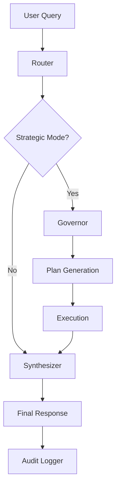

# INDEX: INTELLIGENCE FEATURE (SDD v2)

**Versión**: 1.1  
**Status**: Refactor SDD en progreso  
**Timeline**: 2.5 horas (Agent G)  
**Prioridad**: HIGH (Core Intelligence Refactor)

---

## 📚 DOCUMENTO MAP

### Especificaciones Técnicas

| Documento | Descripción | Ubicación |
|-----------|-------------|-----------|
| **spec-intelligence-v1.md** | Technical specification completa | `sdd/features/intelligence/` |
| **skills-specification.md** | Detalle de Pydantic schemas y lógica de skills | `sdd/features/intelligence/` |
| **feature-intelligence.md** | Rules & Governance | `agent/rules/` |
| **SKILL.md** | Development methods & patterns | `agent/skills/features/intelligence/` |

### Test Specifications (Nueva sección)

| Documento | Escenarios | Ubicación |
|-----------|-----------|-----------|
| **test-plan-v1.md** | Master test plan + strategy | `sdd/features/intelligence/tests/test-specifications/` |
| **test-cases-governor.md** | 15+ test cases para Governor | `sdd/features/intelligence/tests/test-specifications/` |
| **test-cases-skills.md** | 20+ test cases para Skills | `sdd/features/intelligence/tests/test-specifications/` |
| **test-cases-orchestrator.md** | 15+ test cases para Orchestrator | `sdd/features/intelligence/tests/test-specifications/` |

### Engine & Governance

| Documento | Descripción | Ubicación |
|-----------|-------------|-----------|
| **README.md** | Estructura intelligence-engine | `intelligence-engine/` |
| **AUDIT-LOG-SCHEMA.md** | Schema y reglas de auditoría | `intelligence-engine/governance/` |

---

## 🛠️ SKILLS

Lista de skills orquestados por Intelligence:
- **lead_intake**: Procesamiento y prioridad de nuevos leads.
- **prospection_weekly**: Matching semanal de leads y propiedades.
- **recap_weekly**: Resumen ejecutivo analítico de la semana.

---

## 🔄 ORCHESTRATOR FLOW

---

## 📑 CONTRACTS MAPPING

1. **contract-01**: Governor Decision Schema
2. **contract-02**: Query Plan Schema
3. **contract-03**: Synthesizer Output Schema
4. **contract-04**: Strategic Mode Schema
5. **contract-05**: Audit Log Schema
6. **contract-06**: NotebookLM Retrieval Policy

---

## 🚀 READING ORDER (Recomendado)

1. **spec-intelligence-v1.md**: Visión general y alcance.
2. **skills-specification.md**: Detalles de implementación técnica.
3. **test-plan-v1.md**: Cómo validar la feature.
4. **feature-intelligence.md**: Reglas inmutables de la feature.

---

**Status**: SDD COMPLETO + TESTS ESPECIFICADOS  
**Siguiente**: Ejecutar Refactor via Antigravity Prompt  
